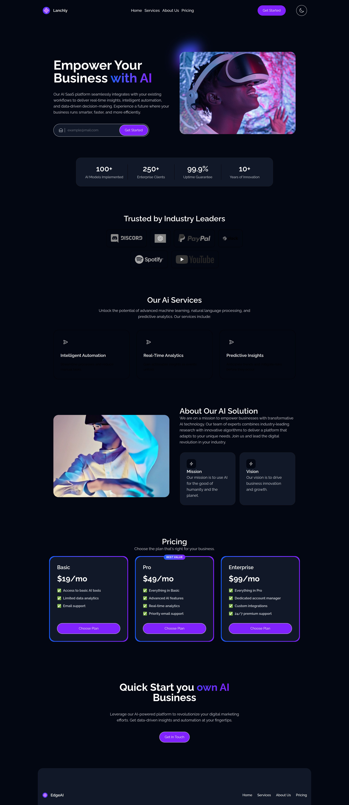

# Lanchly - AI SaaS Landing Page

This is a professional landing page for an AI-based software-as-a-service (SaaS) platform named Lanchly (also referred to as EdgeAI). It is built using a modern frontend stack to ensure high performance, responsiveness, and a clean user interface.
[SAAS-Landing | Live Demo](https://erftube-edgeai.netlify.app/)

## Tech Stack

* React 19: The core UI library for component-based architecture.
* TypeScript: Provides type safety across the application logic.
* Tailwind CSS 4: A utility-first CSS framework for rapid and consistent styling.
* Zustand: Used for global state management, specifically for handling the light and dark theme persistence.
* Vite: The build tool and development server.

## Features

* Theme Management: A built-in dark and light mode toggle that persists across browser sessions using local storage.
* Hero Section: An impactful entrance featuring an email lead capture form and high-quality video background integration.
* Interactive Navigation: A responsive header with mobile-friendly menu logic.
* Social Proof: A section dedicated to displaying trusted brand logos with grayscale-to-color hover effects.
* Performance Stats: A grid section highlighting key business metrics like implemented models and uptime guarantees.
* Service Overviews: Detailed cards explaining technical offerings such as automation, analytics, and predictive insights.
* Mission and Vision: A structured "About Us" section providing context on the core values of the organization.
* Pricing Tables: Clear subscription plans (Basic, Pro, and Enterprise) with feature lists and a "Best Value" indicator for the Pro tier.

## Project Structure

* /assets: Contains static media files including video loops and SVG icons.
* /components: Modular UI parts like the Navbar, Footer, Button, and Layout wrappers.
* /store: Zustand store configuration for theme state logic.
* /constants: Data objects for nav links, brands, services, and pricing plans to keep the components clean.

## Setup Instructions

1. Clone the repository to your local system.
2. Install the project dependencies:
   npm install

3. Run the development server:
   npm run dev

4. Build for production:
   npm run build

## UI Design and Customization

The project uses the Poppins and Raleway font families for a modern look. Styling is handled via Tailwind CSS variables defined in the index.css file, making it easy to change the primary brand colors (Indigo and Violet gradients) or typography settings globally.

## Media Credits

The video backgrounds and brand logos used in this project are placeholders intended for demonstration and educational purposes. Replace these in the /public or /assets folder before deploying for commercial use.

## License

This project is open-source and available under the MIT License.
